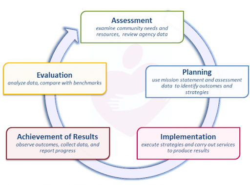

```{r setup, include=FALSE}
knitr::opts_chunk$set(echo = FALSE)
```

# Introduction and Agency Overview

Nationwide, Community Action Agencies (CCAs), like WAGAP, are expected to base their strategies and service priorities on the needs and strengths in their communities. The Results Oriented Management and Accountability (ROMA) framework is a continuous cycle used by CCAs to best meet local needs. Assessing assets and needs in a community is the first phase of the cycle and sets the stage for agency planning and improvement.  

<caption>**Results Oriented Management and Accountability (ROMA) cycle steps:**[^roma-cycle-source]</caption>

<center></center>

As we embark on our next 3-year cycle, WAGAP partnered with Colibri Consulting to conduct a 2020 Community Needs Assessment for our service area. Input from diverse community members, staff and agency partners regarding community assets and needs was collected and analyzed, as outlined in Appendix A. Methodology.

This assessment targets the following ROMA Next Gen Needs Assessment goals:

- Assess level of poverty within the whole community
- Assess how well the needs of low income individuals and families are currently being met – including what assets and resources the community has
- Identify service barriers that limit the effectiveness of the current service network
- Assess relationships with key partners and stakeholders and identify how to strengthen them
- Build awareness of Community Action and our community agenda
- Develop recommendations that will enhance the community’s ability to address the concerns of low income individuals and families  

***


WAGAP is the Community Action Agency for Skamania and Klickitat Counties. Our mission is to: 

<center>
#### _**Strengthen community by inspiring hope and helping people help themselves.**_    
</center>

We reduce poverty by helping people meet basic human needs and increase their self-sufficiency. With  8 locations across two counties, we generate economic impact by bringing hundreds of thousands of grant dollars into the community annually and providing 35 permanent jobs (plus 10 new temp jobs created in response to COVID-19 related needs). Each year, thousands of people turn to WAGAP for short-term assistance and long-term solutions to help them take control of their lives and their futures. Programs offering nutrition assistance and food banks, emergency housing and homeless shelter, domestic violence prevention and crime victim services, youth substance abuse prevention, care coordination, home energy and weatherization assistance, on the job training, COVID-19 relief funds, and after school youth programs are some of the ways WAGAP is meeting the promise of Community Action.

[^roma-cycle-source]: ROMA cycle illustration and assessment goals from ROMA Next Gen Needs Assessment guidelines from https://communityactionpartnership.com/publication_toolkit/roma-next-gen-beyond-the-basics/

# Findings

## Community Member Survey Results

```{r}
library(tidyverse)
library(janitor)

WAGAP <- read.csv("data/WAGAP-survey-data.csv") %>% 
  clean_names()

```

### survey respondent demographics

```{r}
WAGAP %>% 
  summarise(median_household_size = median(how_many_people_are_in_your_household_sharing_income_and_expenses, na.rm = TRUE), number_of_responses = n())
            
```
```{r}
WAGAP %>% 
  group_by(please_select_the_races_or_ethnicities_you_most_identify_with, is_food_a_challenge_in_your_community) %>% 
  summarise(median_household_size = median(how_many_people_are_in_your_household_sharing_income_and_expenses, na.rm = TRUE), number_of_responses = n())
```


```{r}
WAGAP %>% 
  count(please_select_the_races_or_ethnicities_you_most_identify_with, is_food_a_challenge_in_your_community)
```

```{R}
WAGAP %>% 
  drop_na(is_food_a_challenge_in_your_community) %>% 
  filter(please_select_the_races_or_ethnicities_you_most_identify_with == "White" | please_select_the_races_or_ethnicities_you_most_identify_with == "Native American/American Indian" | please_select_the_races_or_ethnicities_you_most_identify_with == "Hispanic/Latino/LatinX") %>% 
  count(is_food_a_challenge_in_your_community, please_select_the_races_or_ethnicities_you_most_identify_with) %>% 
  arrange(n)
```

## Number of adult women with family size greater than 1

```{R}
WAGAP %>% 
  filter(please_mark_the_gender_you_most_identify_with == "Female") %>% 
  filter(how_many_people_are_in_your_household_sharing_income_and_expenses > 1) %>% 
  filter(what_age_group_are_you_in == "18-64 years old") %>% 
  group_by(how_many_people_are_in_your_household_sharing_income_and_expenses, please_mark_the_gender_you_most_identify_with) %>% 
  summarise(family_size = mean(how_many_people_are_in_your_household_sharing_income_and_expenses), number = n()) 
```

```{r}
# install.packages("flextable")
# https://davidgohel.github.io/flextable/index.html
library(flextable)
```

```{R}
WAGAP %>% 
  drop_na(please_select_the_races_or_ethnicities_you_most_identify_with, is_food_a_challenge_in_your_community) %>% 
  tabyl(please_select_the_races_or_ethnicities_you_most_identify_with, is_food_a_challenge_in_your_community) %>% 
  adorn_totals(where = c("row", "col")) %>% 
  adorn_percentages() %>% 
  adorn_pct_formatting(digits = 0, rounding = "half up", affix_sign=TRUE) %>% 
  adorn_ns() %>% 
  adorn_title()

# flextable() %>%  NOTE: not working so I commented this out
#  theme_zebra()

```
## extra text test