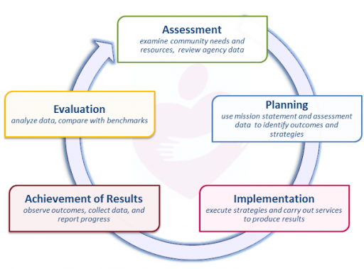

```{r setup, include=FALSE}
knitr::opts_chunk$set(echo = FALSE, warning = FALSE, message = FALSE, 
                      fig.height = 5, fig.width = 7,
                      cache = TRUE)

# QUESTION: is there a way to resize images to be rendered in Word??

#NOTE to self: to explore David Keyes' html template themes & refer to https://www.datadreaming.org/post/r-markdown-theme-gallery/ for other html themes
# watch week 11 class for publishing options (start at 11:30 min, 25:00 - google drive publishing, 41:00 paged report templates for pdf) https://rfortherestofus.com/rin3-spring-2021-syllabus/
# https://pagedreport.rfortherestofus.com/
```

# WAGAP Poverty Report

## Introduction and Agency Overview

Nationwide, Community Action Agencies (CCAs), like WAGAP, are expected to base their strategies and service priorities on the needs and strengths in their communities. The Results Oriented Management and Accountability (ROMA) framework is a continuous cycle used by CCAs to best meet local needs. Assessing assets and needs in a community is the first phase of the cycle and sets the stage for agency planning and improvement.  

<caption>**Results Oriented Management and Accountability (ROMA) cycle steps:**[^roma-cycle-source]</caption>

<center></center>

As we embark on our next 3-year cycle, WAGAP partnered with Colibri Consulting to conduct a 2020 Community Needs Assessment for our service area. Input from diverse community members, staff and agency partners regarding community assets and needs was collected and analyzed, as outlined in Appendix A. Methodology.

***
This assessment targets the following ROMA Next Gen Needs Assessment goals:

- Assess level of poverty within the whole community
- Assess how well the needs of low income individuals and families are currently being met – including what assets and resources the community has
- Identify service barriers that limit the effectiveness of the current service network
- Assess relationships with key partners and stakeholders and identify how to strengthen them
- Build awareness of Community Action and our community agenda
- Develop recommendations that will enhance the community’s ability to address the concerns of low income individuals and families  

***


WAGAP is the Community Action Agency for Skamania and Klickitat Counties. Our mission is to: 

### *Strengthen community by inspiring hope and helping people help themselves*

We reduce poverty by helping people meet basic human needs and increase their self-sufficiency. With  8 locations across two counties, we generate economic impact by bringing hundreds of thousands of grant dollars into the community annually and providing 35 permanent jobs (plus 10 new temp jobs created in response to COVID-19 related needs). Each year, thousands of people turn to wagap for short-term assistance and long-term solutions to help them take control of their lives and their futures. Programs offering nutrition assistance and food banks, emergency housing and homeless shelter, domestic violence prevention and crime victim services, youth substance abuse prevention, care coordination, home energy and weatherization assistance, on the job training, COVID-19 relief funds, and after school youth programs are some of the ways WAGAP is meeting the promise of Community Action.

[^roma-cycle-source]: ROMA cycle illustration and assessment goals from ROMA Next Gen Needs Assessment guidelines from https://communityactionpartnership.com/publication_toolkit/roma-next-gen-beyond-the-basics/

\newpage

# Findings

## Community Member Survey Results

```{r}
library(tidyverse)
library(janitor)

# install table formatting package---------------------

# install.packages("flextable")
# https://davidgohel.github.io/flextable/index.html
library(flextable)
# install.packages("gt")
library(gt)

# custom fonts and themes

# install.packages("devtools")
# devtools::install_github("hrbrmstr/hrbrthemes")
library(hrbrthemes)

# add ability to place plots side by side or stacked in knitted doc
# install.packages("devtools")
# devtools::install_github("thomasp85/patchwork")
library(patchwork)
library(scales)

library(extrafont)
# font_import(pattern = "Georgia")
windowsFonts(`Georgia` = windowsFont("Georgia"))
# windowsFonts(`Arial` = windowsFont("Arial"))

library(ggtext)
library(treemapify)

# custom theme 
theme_draft <- function() {
  theme_ipsum_rc(base_family = "Roboto") +
    # ggthemr() +
    # theme_minimal()+
  theme(axis.title.x = element_blank(),
        axis.title.y = element_text(family = "Roboto", hjust = 0),
        axis.text = element_text(family = "Georgia",
                                  size = 15),
        legend.text = element_text(family = "Georgia"),
        panel.grid.minor.y = element_blank(),
        panel.grid.major.x = element_line(color = "orange")) +
  theme(plot.title = element_markdown()) 
}

```

```{r} 
# load data -------------------------------------

wagap <- read_rds("data/WAGAP_tidy_food.rds")


```

### survey respondent demographics

```{r}
median_income <- wagap %>% 
  summarise(median_household_income = median(household_income, na.rm = TRUE), number_of_responses = n()) %>% 
  pull(var = median_household_income) 

median_household <- wagap %>% 
  group_by(race_ethnicity, is_food_a_challenge) %>% 
  summarise(median_household_size = median(household_size, na.rm = TRUE), number_of_responses = n()) %>%
  arrange(number_of_responses)

median_household <- flextable(median_household)
# median_household
```
The median household income reported in our survey of 625 community members was  `r median_income`. Most people identify as White in our service area. Hispanic and Native American are the next largest groups.


```{r}
race_ethnicity_proportions <- wagap %>% 
  count(race_ethnicity) %>% 
  mutate(pct_of_total_race_ethnicity = n/sum(n)) %>% 
  arrange(desc(n)) %>% 
  mutate(pct_of_total_race_ethnicity = percent(pct_of_total_race_ethnicity, accuracy = 0.1)) %>% 
  set_names(c("Race/Ethnicity", "n", "% of total"))


race_ethnicity_table <- flextable(race_ethnicity_proportions)
race_ethnicity_table <- (set_caption(x = race_ethnicity_table, caption = "Service Area Diversity", style = "Table Caption"))

# QUESTION: how can I format the flextable title (or caption) when knitting to Word?

race_ethnicity_table <- width(race_ethnicity_table, j = 1, width = 3)

race_ethnicity_table <- theme_booktabs(race_ethnicity_table)
race_ethnicity_table <- align(race_ethnicity_table, j = c(2, 3), i = 1, part = "header", align = "right")
race_ethnicity_table <- align(race_ethnicity_table, j = c(2, 3), part = "body", align = "right")
race_ethnicity_table
```

\newpage

#### Participant Poverty Status  
### 50-year County Poverty Trends (ACS data), participant poverty levels plot
(to be calculated and plotted in phase 2 of this analysis)

\newpage 
## Food Security - who is struggling?
```{r eval=FALSE}
wagap %>% 
  count(race_ethnicity, is_food_a_challenge)
```
The majority of races and ethnicities in our area are Native American, Hispanic and White. Most of them agree that food is a problem here.
```{r}
food_probs_by_race <- wagap %>% 
  drop_na(is_food_a_challenge) %>% 
  filter(race_ethnicity == "White" | race_ethnicity == "Native American/American Indian" | race_ethnicity == "Hispanic/Latino/LatinX") %>% 
  count(is_food_a_challenge, race_ethnicity) %>% 
  arrange(n) %>% 
set_names(c("is food a challenge?", "Race/Ethnicity", "n"))
  
food_probs_by_race <- flextable(food_probs_by_race)
food_probs_by_race <- theme_booktabs(food_probs_by_race)
food_probs_by_race <- width(food_probs_by_race, j = c(1, 2), width = c(2, 3))
food_probs_by_race
```


```{r eval=FALSE}

probs_pct <- wagap %>% 
  drop_na(race_ethnicity, is_food_a_challenge) %>% 
  tabyl(race_ethnicity, is_food_a_challenge) %>% 
  adorn_totals(where = c("row", "col")) %>% 
  adorn_percentages() %>% 
  adorn_pct_formatting(digits = 0, rounding = "half up", affix_sign=TRUE) %>% 
  adorn_ns() %>% 
  adorn_title() 

probs_pct

# NOTE: flextable() cannot be created from a tabyl, and adorn is a tabyl function

```

\newpage

# Food and Ethnicity Summary Chart

```{r fig.height = 6, fig.width = 10}


# total all challenge level responses for labeling purposes (don't forget to ungroup after!)
food_challenges_by_ethnicity <- wagap %>% 
count(race_ethnicity, is_food_a_challenge) %>% 
group_by(is_food_a_challenge) %>% 
mutate(sum_of_all_challenge_level_responses = sum(n)) %>% 
ungroup() %>% 
mutate(pct_of_all_challenge_level_responses = sum_of_all_challenge_level_responses / sum(n))


# re-order challenge levels to show proper order in the chart y-axis:
challenge_level_tib <- tibble(
  challenge_label = c("Yes, a BIG problem!", "Yes, somewhat", "No")
) %>% 
  mutate(challenge_order = row_number())


# NOTE to self: see github.com/gadenbuie/tidyexplain for visual explanation for different join types

food_challenges_by_ethnicity <- food_challenges_by_ethnicity %>% 
  left_join(challenge_level_tib,
            by = c("is_food_a_challenge" = "challenge_label")) %>% 
  mutate(is_food_a_challenge = fct_reorder(is_food_a_challenge,
                                                             challenge_order),
    is_food_a_challenge = fct_rev(is_food_a_challenge)) 


summary_food_plot <- food_challenges_by_ethnicity %>% 
  ggplot(aes(y = is_food_a_challenge,
             x = n,
             fill = race_ethnicity)) +
  geom_col() + 
# NOTE to self: to format the percent that shows up in the label (to make it say "21.9%" instead of the decimal): use scales::percent
  geom_text(aes(label = scales::percent(pct_of_all_challenge_level_responses, accuracy = 0.1),
                 x = sum_of_all_challenge_level_responses + 15),
#  position = position_stack(vjust = .5), THIS LINE NOT NEEDED SINCE LABEL POSITION IS ASSIGNED WITH LABEL ARGUMENT ABOVE
            color = "black", show.legend = FALSE,
            family = "Georgia") +
    scale_fill_brewer(palette = "Set3") +
  labs(title = "<span style = 'color: orange'>Food</span> is a problem for many", x = "number of responses", y = "Is food a challenge in your community?", fill = "") +
  theme_draft() +
# NOTE:  element_text and element_markdown can not both be used to refer to the title.  Since title was assigned to element_markdown in theme_draft it must be referred this way here as well. element_markdown makes the text html so certain words can be formatted differently (orange in this case)
  theme(plot.title = element_markdown(family = "Georgia"),
        axis.title.x = element_text(colour = "orange", hjust = 1),
        legend.text = element_text(family = "Georgia"),
        legend.position = "bottom")


summary_food_plot

# NOTE to self: x = sum_of_all_challenge_level_responses added to the aes removed all but one sum_of_all_challenge_level_responses label from each bar in this plot.  Use geom_text instead of geom_label to avoid boxes around labels

```

\newpage

# food facet plot

```{r fig.height = 6, fig.width = 10, eval=TRUE}

facet_plot_1 <- food_challenges_by_ethnicity %>% 
  ggplot(aes(y = is_food_a_challenge,
             x = n,
             fill = race_ethnicity)) +
  geom_col() + 
  facet_wrap(~race_ethnicity) +
  geom_text(aes(label = n,
                x = ifelse(n < 50, n + 15, n - 25)),
            color = "purple") +
    scale_fill_brewer(palette = "Set2") +
  labs(title = "Food is a problem for many", x = "number of responses", y = "Is food a challenge in your community?", fill = "") +
  theme_bw()

facet_plot_1

# NOTE: theme elements demos: https://henrywang.nl/ggplot2-theme-elements-demonstration/

```


```{r fig.height = 10, fig.width = 11, eval=TRUE}

# facet plot example code
# facet_plot_sans_key <- facet_plot_1 + theme(legend.position = "none")

# facet_plot_sans_key / summary_food_plot
```
\newpage
# Treemap showing causes of food problems

```{r}

food_problems <- read_rds("data/food_problems.rds")

food_problems_categorized <- read_rds("data/food_problems_categorized.rds")

unique_causes <- food_problems %>% 
  separate_rows(reasons_food_is_a_problem, sep = ",") %>% 
  mutate(reasons_food_is_a_problem = str_trim(reasons_food_is_a_problem)) %>% 
  distinct(reasons_food_is_a_problem, .keep_all = TRUE) 
  
# ensure there is only 1 row for each cause (grouped by race_ethnicity just for kicks).  NOTE: reasons_food_is_a_problem is sorted alphabetically by race, and each cause is verified to be unique since the highest 'n' is 1 in each group.  
unique_causes <- unique_causes %>% 
  group_by(race_ethnicity) %>% 
  count(reasons_food_is_a_problem, sort = TRUE) %>% 
  arrange(desc(n))
```


```{r fig.height = 9, fig.width = 11, eval=TRUE}
# NOTE: treemapify works with ggplot as geom_treemap.  See http://wilkox.org/treemapify/ and https://r-charts.com/part-whole/treemapify/ 

food_probs_mapped <- food_problems_categorized %>% 
#  select(food_problem_lack_of_transportation:food_problem_not_enough_income) %>% 
  mutate(unique_food_problems = ifelse(is.na(unique_food_problems), NA, "other")) %>% 
    mutate(food_problem_other = str_detect(unique_food_problems, "other")) %>% 
  select(-unique_food_problems) %>% 
  pivot_longer(everything()) %>% 
  filter(value == TRUE) %>% 
  count(name) %>% 
  mutate(plot_label = case_when(
    name == "food_problem_lack_of_transportation" ~ "lack of transportation", name == "food_problem_not_enough_alternatives" ~ "not enough alternative food sources available", name ==  "food_problem_reduced_access" ~ "reduced access to school meals because of COVID-19", name == "food_problem_not_enough_income" ~ "not enough income to purchase food", name == "food_problem_other" ~ "other reasons"
  )) %>% 
  ggplot(aes(area = n,
             fill = n,
             label = paste(plot_label, n, sep = "\n"))) +
  geom_treemap() +
  geom_treemap_text(aes(fontface = "italic", family = "Georgia"),
                    colour = c(rep("white", 3),
                               rep("grey", 1),
                               rep("white", 1)),
                    place = "topleft", grow = FALSE, reflow = T, size = 16) +
  
# NOTE to self: for some reason label color & other specifications must be set outside of the aes
  scale_fill_distiller(palette = "YlGnBu",
                       trans = "reverse", 
                       name = "number of \nresponses",
                       limit = c(375, 25)) +
  # trans changes the order of the color scale
  guides(fill = guide_colorbar(reverse = TRUE)) +

# NOTE: scale_fill_fermenter can be used to create a binned scale instead of continuous (so each rectangle has a specifically assigned color).  see Charlie's video: https://share.rfor.us/xQu70y6r
  
  theme_ipsum_rc() +
  theme(plot.title = element_markdown()) +
 # theme(plot.title = element_text(color = "blue", family = "Helvetica")) +
  theme(legend.text = element_text(family = "Georgia")) +
  theme(legend.position = "right") + 
  theme(plot.caption = element_text(size = 12)) +
  labs(title = "Food problems are dominated by lack of <span style = 'color: purple'>income</span>", caption = "transportation is also a big problem, and there's a lack of alternative food sources \nlike gleaning opportunities and ethnic food markets") 
  
  

# NOTE: colorbrewer2.org gives a good look at color scale options

food_probs_mapped

```


